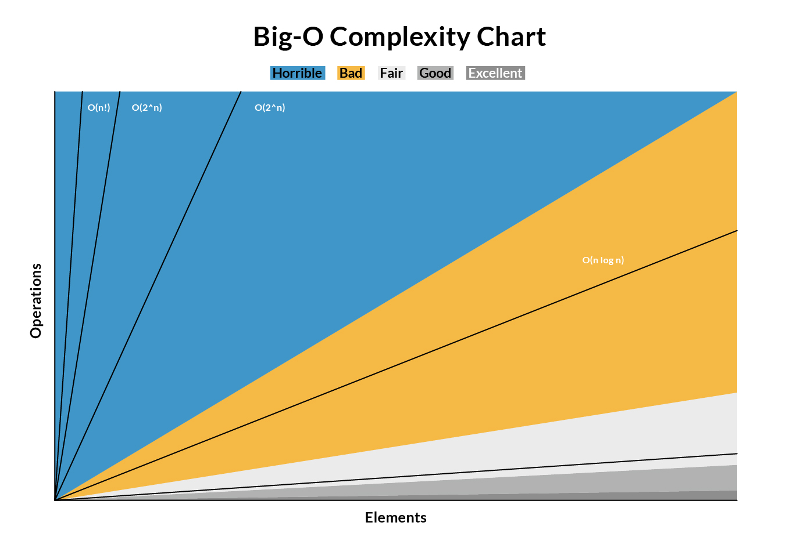
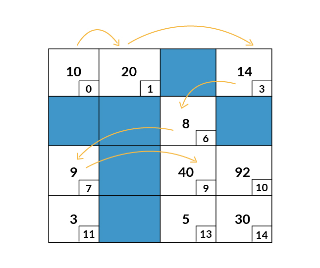
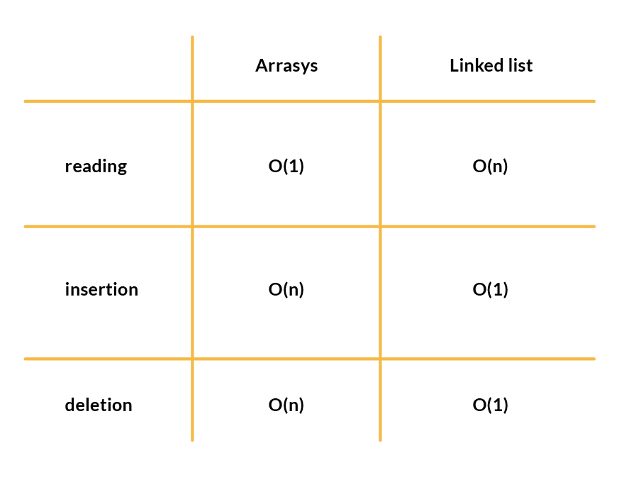
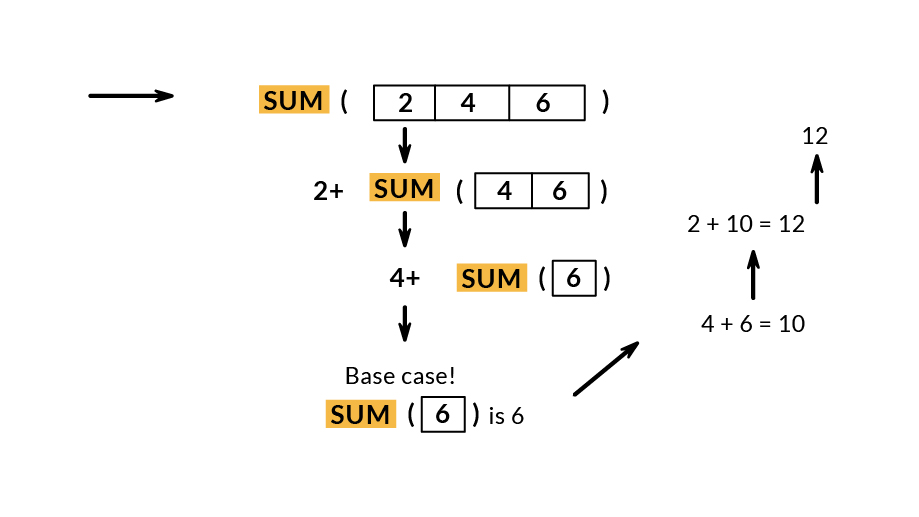
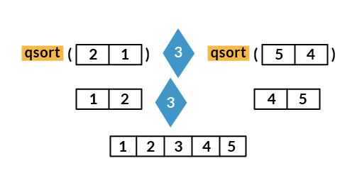
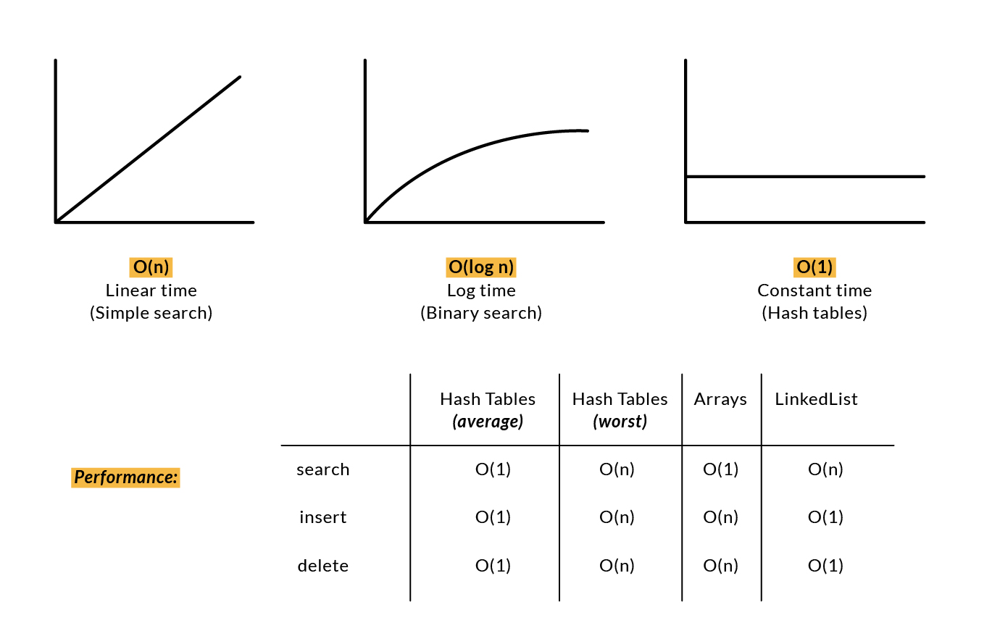
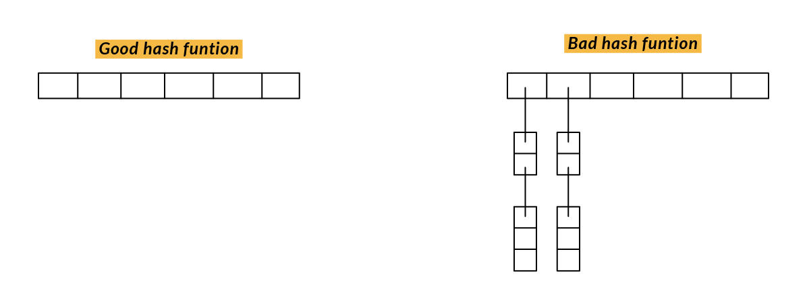
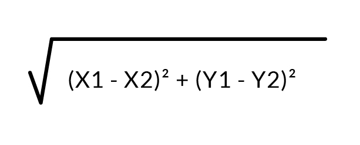

# ALGORITMOS Y ESTRUCTURAS DE DATOS

## ¿Qué es un algoritmo?

Los algoritmos son más simples de lo que pensamos. Desde que somos niños nos enseñan cómo completar las tareas del día a día. Un algoritmo es un conjunto de instrucciones que se siguen para lograr un objetivo o producir un resultado, por ejemplo, aprender a caminar, atarse los zapatos o preparar un pastel. Todos estos procesos se nos enseñan mediante un procedimiento paso a paso.

Veamos un ejemplo de un algoritmo muy sencillo, los pasos para preparar unos brownies:

```py
function PrepareBrownies(flavor){

 1. Heat Oven to 350 F
 2. Mix flour, baking powder, salt in a bowl
 3. Mix melted butter with "+ flavor +" chips in another bowl
 4. Mix eggs with sugar in a different bowl
 5. First combine the butter bowl with the eggs bowl.
 6. Add the flour bowl to the previous mix.
 7  Mix. 
 8. Put in pan
 9. Bake for 30 minutes

}

PrepareBrownies('chocolate')
```

## Estructuras de datos

La mayoría de los problemas en informática tienen algún tipo de datos asociados, que tenemos que usar para resolver el problema y llegar a una conclusión. Entonces, una estructura de datos es una forma de organizar y administrar esos datos a nivel de memoria de manera que podamos operar efectiva y eficientemente con esos datos.

Para tener una diferencia clara entre algoritmos y estructuras de datos, podemos decir que los algoritmos actuarían como los verbos y las estructuras de datos serían los sustantivos.

## ¿Qué es la complejidad del tiempo?

Un problema simple se puede resolver usando muchos algoritmos diferentes. Algunas soluciones simplemente toman menos tiempo y espacio que otras.

Pero, ¿cómo sabemos qué soluciones son más eficientes?

La complejidad del tiempo en la programación se usa más comúnmente en el diseño de algoritmos. Significa cuánto tiempo tardará un algoritmo con un número dado de entradas (n) en completar su tarea. Por lo general, se define utilizando la notación Big-O. Analiza la complejidad del tiempo todas las veces que intentes resolver un problema. Te hará un mejor desarrollador.

Veamos algunas complejidades del tiempo y sus definiciones:

**O(1) - Tiempo constante:** Dada una entrada de tamaño n, el algoritmo solo necesita un paso para realizar la tarea.

**O(log n) - Tiempo logarítmico:** dada una entrada de tamaño n, la cantidad de pasos necesarios para realizar la tarea se reduce en algún factor con cada paso.

**O(n) - Tiempo lineal:** Dada una entrada de tamaño n, el número de pasos necesarios está directamente relacionado (1 a 1).

**O(n^2) - Tiempo cuadrático:** Dada una entrada de tamaño n, la cantidad de pasos necesarios para realizar una tarea es el cuadrado de n.

**O(C^n) - Tiempo exponencial:** Dada una entrada de tamaño n, la cantidad de pasos necesarios para realizar una tarea es una constante elevada a la potencia n (una cantidad bastante grande).

Usemos n=16 para entender la complejidad del tiempo con un ejemplo.


```python
let n = 16:
    
    
O(1) = 1 step

O(log n) = 4 steps -- assuming base 2

O(n) = 16 steps

O(n^2) = 256 steps

O(2^n) = 65,356 steps
```



## Comprensión de algoritmos y estructuras de datos.

### 1. Primer algoritmo: Búsqueda Binaria

Supongamos que estás buscando una palabra en un diccionario y comienza con K. Podrías comenzar desde el principio y seguir pasando las páginas hasta llegar a las K. Pero es más probable que comience en una página en el medio, porque sabe que las K estarán cerca del medio del diccionario. Este es un problema de búsqueda. Todos estos casos utilizan el mismo algoritmo para resolver el problema: la búsqueda binaria.

Para cualquier lista de n, la búsqueda binaria tomará pasos log2n para ejecutarse en el peor de los casos.

Volviendo a nuestro ejemplo inicial podemos decir que:

Para buscar en un diccionario de 240.000 palabras con búsqueda binaria, reduce el número de palabras a la mitad hasta que te quedes con una palabra. El resultado en el peor de los casos sería de 18 pasos, mientras que una búsqueda simple habría tomado 240.000 pasos.

**Complejidad del tiempo:** 

- Una búsqueda normal se ejecuta en un tiempo lineal O(n).

- Una búsqueda binaria se ejecuta en tiempo logarítmico (tiempo logarítmico) O(log n).

- La constante casi nunca importa para la búsqueda simple frente a la búsqueda binaria, porque O (logn) es mucho más rápido que O (n) cuando su lista crece.

### 2. Segundo Algoritmo: Clasificación de Selección

#### Arrays vs LinkedList (estructuras de datos)

A veces es necesario almacenar una lista de elementos en la memoria. Supongamos que tienes una lista de tareas para hacer hoy. Primero almacenémoslo en un array (arreglo). Eso significa que todas sus tareas se almacenarán una al lado de la otra en la memoria.

10 está en el índice 2

  

Ahora supongamos que después de agregar las primeras cuatro tareas, deseas agregar una quinta pero el siguiente espacio está ocupado. Con las listas vinculadas, tus tareas pueden estar en cualquier lugar de la memoria.

Los elementos no están uno al lado del otro, por lo que no puede calcular instantáneamente la posición, debe ir al primer elemento para obtener la dirección del segundo elemento. Luego ve al segundo elemento para obtener la dirección del tercer elemento. Los cuadrados azules son memoria en uso por otra persona, no puedes agregar datos allí porque ya está ocupado.




Supongamos que haces tu lista de gastos del mes. Al final del mes, verificas cuánto gastaste.

Eso significa que estás teniendo muchas inserciones y algunas lecturas. ¿Deberías usar un array o una lista?

- Los arrays tienen lecturas rápidas e inserciones lentas.

- Las listas enlazadas tienen lecturas lentas e inserciones rápidas.

Tendría más sentido usar una lista enlazada porque insertarás más a menudo de lo que leerás tu lista de gastos. Además, solo tienen lecturas lentas si estás accediendo a elementos aleatorios de la lista, pero estás accediendo a todos. Otro dato importante es que para agregar un elemento en medio de una lista ordenada, también las listas enlazadas serán mejores porque solo tienes que cambiar a lo que apunta el elemento anterior.

¿Qué pasa si quiero eliminar un elemento de la lista?

Nuevamente, las listas son mejores porque solo necesitas cambiar lo que apunta el elemento anterior.

¿Cuáles se usan más? ¡Depende del caso!

- Los arrays se usan más porque permiten el acceso aleatorio.

- La lista vinculada solo puede hacer acceso secuencial (leer elementos uno por uno), pero son buenos para inserciones/eliminaciones.

Cuando desees almacenar varios elementos, ¿deberías usar un array o una lista?

- En un array, los elementos se almacenarían uno al lado del otro. Permite lecturas rápidas.

*Todos los elementos del array deben ser del mismo tipo.*

- En una lista, los elementos se almacenan por todas partes, un elemento almacena la dirección del siguiente. Permite insertar y eliminar rápidamente.


**Complejidad de tiempo:**

**Práctica recomendada: haz un seguimiento del primer y el último elemento de una lista vinculada para que solo tome O(1)**



#### Algoritmo de clasificación de selección

Recuerda que el tiempo O(n) significa que toca todos los elementos de una lista una vez.

Ejemplo: 

Tienes una lista de canciones con el recuento de veces que las has reproducido. Para ordenar la lista de canciones y ver cuál es su favorita, debe verificar cada elemento de la lista para encontrar el que tiene el mayor número de reproducciones.

Esto lleva O(n) tiempo y tienes que hacerlo n veces.


```python
#Encuentra el elemento más pequeño en un array y utilízalo para escribir la ordenación por selección

def findsmallest(arr):
    smallest = arr[0] ----> stores smallest value
    smallest_index = 0 -----> stores index of the smallest value
    for i in range(1, len(arr)):
        if arr[i] < smallest:
            smallest = arr[i]
            smallest_index = i
    return smallest_index

#Ahora escribamos el Ordenamiento por selección:

def SelectionSort(arr):   ------> sorts an array
    newArr = []
    for i in range(len(arr)):
        smallest = findSmallest(arr)   ----->finds the smallest and adds it to the new array.
        newArr.append(arr.pop(smallest))
    return newArr
```

### 3. Recursividad

Recursividad significa dividir un problema en un caso base y un caso recursivo.

La recursividad es donde una función se llama a sí misma. Debido a que una función recursiva se llama a sí misma, es fácil escribir una función incorrectamente que termine en un bucle infinito.

Si eso sucede, debe presionar **CTRL + C** para eliminar su secuencia de comandos.

Es por eso que cada función recursiva tiene 2 partes:

1. Caso base (cuando no se vuelve a llamar a sí mismo).

2. Caso recursivo (cuando se llama a sí mismo).

No hay ningún beneficio de rendimiento en el uso de la recursividad, de hecho, a veces los bucles son mejores.

"Los bucles pueden lograr una ganancia de rendimiento para su programa. La recursividad puede lograr una ganancia de rendimiento para el programador"



¡Recuerda! La recursividad realiza un seguimiento del estado. CONSEJO: Cuando se trata de una función recursiva que involucra un array, el caso base suele ser un array vacío o un array con un elemento.

Si estamos atascados, deberíamos intentar eso primero.

¿Por qué no usar un bucle?

Porque este es un adelanto de la programación funcional.

Los lenguajes de programación funcional como Haskell no tienen bucles.

sum[ ] = 0   --->  caso base

sum(x; xs) = x + sum(xs)  --->  caso recursivo

Veamos un ejemplo:


```python
# 1. Función de suma anterior

def sum(list):
    if list == []:
        return 0
    return list[0] + sum(list[1:])

# 2. Función recursiva para contar el número de elementos en una lista:

def count(list):
    if list == []:
        return 0
    return 1 + count(list[1:])

# 3. Encuentra el número máximo en una lista

def max(list):
    if len(list) == 2:
        return list[0] if list[0] > list[1] else list[1]
    submax = max(list[1:])
    return list[0] if list[0] > submax else submax
```

#### La pila (estructura de datos)

La pila (estructura de datos).

¿Recuerdas cuando hablamos de arreglos y listas? Teníamos una lista de tareas. Podríamos agregar elementos de tareas en cualquier lugar de la lista o eliminar elementos aleatorios. Ahora, imaginemos que tenemos esa misma lista de tareas pero ahora en forma de una pila de notas adhesivas. Esto es mucho más simple porque cuando insertamos un elemento, se agrega a la parte superior de la lista. Ahora nuestra lista de tareas solo tiene dos acciones:

1. Empujar (insertar, agregar un nuevo elemento en la parte superior).
2. Pop (eliminar el elemento superior y leerlo).

En nuestra computadora, todas las llamadas a funciones van a la pila de llamadas.
La pila de llamadas puede volverse muy grande, lo que ocupa mucha memoria.

### 4. Tercer algoritmo: QuickSort

Divide y vencerás, una técnica recursiva bien conocida para resolver problemas y un buen ejemplo de código elegante.

¿Recuerdas la recursividad? En el caso de QuickSort, elegimos un pivote (1 elemento de la matriz)

Encontremos los elementos más pequeños que el pivote y los elementos más grandes que el pivote. Esto se llama partición.



¡Acabas de ver un adelanto de que tu algoritmo funciona!

Veamos un ejemplo de código para QuickSort:


```python
def quicksort(array):
    if len(array) < 2:
        return array    #---> caso base: los arrays con 0 o 1 elemento ya están ordenados
    else:
        pivot = array[0]  #---> caso recursivo
        less = [ i for i in array[1: ] if i <= pivot]   #----> subarreglo de elementos menos que pivote
        greater = [ i for i in array[1: ] if i > pivot]   #---> subarreglo de elementos mayor que el pivote
        return quicksort(less) + [pivot] + quicksort(greater)
    
    print(quicksort([10,5,2,3]))
```

-Dividir y conquistar funciona rompiendo un problema en pedazos cada vez más pequeños.

-Si usas QuickSort, elije un elemento aleatorio como pivote.

-El tiempo de ejecución promedio de QuickSort es 0 (nlogn).

-La constante en la notación Big O puede ser importante a veces, es por eso que la ordenación rápida es más rápida que la ordenación combinada.

### 5. Tablas hash (estructura de datos)

Una función hash es donde pones un string (cadena) y obtienes un número.

Son geniales cuando quieres crear un mapeo de una cosa a otra o cuando quieres buscar algo.

En Python llamamos tablas hash: diccionarios

dict() ---> atajo en Python = { }

La función 'get' devuelve el valor si, por ejemplo, 'Maria' está en la tabla hash.

Veamos un ejemplo para ver si una persona ya ha recogido su premio en efectivo:


```python
picked = {}

def check_picked_prize(name):
    if picked.get(name):
        print('Kick them out')
    else:
        picked[name] = True
        print('Let them pick up their cash prize')
```

Si esto fuera una lista, esta función eventualmente se volvería muy lenta, pero debido a que los estamos almacenando en una tabla hash, instantáneamente nos dice si el nombre está en la tabla hash o no. Aquí, verificar si hay duplicados es muy rápido.

If this would be a list, this function would become really slow eventually, but because we are storing them in a hash table, it instantly tells us if the name is in the hash table or not. Here, checking if there are duplicates is very fast.

Veamos un poco de código para el almacenamiento en caché:


```python
cache = {}

def get_page(url):
    if cache.get(url):
        return cache[url]
    else:
        data = get_data_from_server(url)
        cache[url] = data 
        return data  
```

Los hashes son buenos para modelar relaciones de una cosa a otra, para filtrar duplicados, para almacenar en caché/memorizar datos en lugar de hacer que nuestro servidor haga el trabajo.

**Colisiones:** Ocurren cuando dos llaves han sido asignadas a la misma ranura.

Las tablas hash funcionan con tiempo constante O (1) (no significa tiempo instantáneo)



Tratemos de no alcanzar el peor de los casos con tablas hash. Para hacer eso, necesitamos evitar colisiones. ¿Como hacemos eso? Usando un factor de carga bajo y una buena función hash.

**¿Cuál es el factor de carga de una tabla hash?**

Es el número de elementos en la tabla hash dividido por el número total de ranuras.


Cuando el factor de carga comienza a crecer > 1, es hora de cambiar el tamaño. Cuando nos estamos quedando sin espacio, creamos un nuevo array que es más grande.

**Regla:** Haz un array que tenga el doble de tamaño.

También deberíamos cambiar el tamaño cuando nuestro factor de carga sea superior a 0,7, porque el cambio de tamaño es costoso y no queremos cambiar el tamaño con demasiada frecuencia.



**Datos importantes:**

-Casi nunca tendremos que implementar una tabla hash nosotros mismos, porque el lenguaje de programación debería tener una y podemos suponer que obtendremos el rendimiento promedio del caso: tiempo constante.

-Podemos hacer una tabla hash combinando una función hash con un array.

-Las colisiones son malas, por lo que debemos minimizarlas.


### 6. Breadth-First Search (Búsqueda en anchura)

breadth-first search nos dice si hay un camino de A a B, y si hay un camino, breadth-first va a encontrar el camino más corto.

Si encontramos un problema como 'Encontrar el camino más corto', deberíamos intentar modelar nuestro problema como un gráfico y usar Breadth-first para resolverlo.

**Datos importantes sobre Breadth-first search:**

-Un gráfico dirigido tiene flechas y la relación sigue la dirección de la flecha.

-Los gráficos no dirigidos no tienen flechas y la relación va en ambos sentidos.

-Las colas de espera son FIFO (primero en entrar, primero en salir).

-Las acciones son LIFO (último en entrar, primero en salir)

-Necesitamos verificar los elementos en el orden en que se agregaron a la lista de búsqueda, por lo que la lista de búsqueda debe ser una cola. De lo contrario, no obtendremos el camino más corto. Una vez que verificamos algún elemento, debemos asegurarnos de no volver a verificarlo. De lo contrario, podríamos terminar en un bucle infinito.

### 7. Algoritmo de Dijkstra

Mientras que Breadth-first se usa para calcular la ruta más corta para un gráfico no ponderado, el algoritmo de Dijkstra se usa para calcular la ruta más corta para un gráfico ponderado.

Los bordes de peso negativo rompen el algoritmo, por lo que no podemos usar bordes de peso negativo con el algoritmo de Dijkstra. En ese caso, hay un algoritmo para eso llamado algoritmo de Bellman Ford.

### 8. Algoritmo Greedy (codicioso)

Cómo abordar lo imposible: problemas que no tienen solución algorítmica rápida (problemas NP-completos). 

¿Cómo identificar tales problemas?

Sería mejor si los identificamos cuando los vemos, así no perdemos tiempo tratando de encontrar un algoritmo rápido para ellos. Existen algoritmos de aproximación, y son útiles para encontrar rápidamente una solución aproximada a un problema NP-completo.

Estos algoritmos se juzgan por lo rápidos que son y que tan cerca están de la solución óptima.

**Estrategia Greedy:** Una estrategia muy simple para resolver problemas.

Un algoritmo greedy es simple. En cada paso, elije el movimiento óptimo. Son fáciles de escribir y rápidos de ejecutar, por lo que constituyen un buen algoritmo de aproximación. Optimizan localmente, con la esperanza de terminar con un óptimo global.

No hay una manera fácil de saber si el problema en el que estamos trabajando es NP-completo. Aquí hay algunos obsequios:

-Nuestro algoritmo se ejecuta rápidamente con un puñado de elementos, pero realmente se ralentiza con más elementos.

-Todas las combinaciones de X generalmente apuntan a un problema NP-completo.

-¿Necesitamos calcular 'todas las versiones posibles de X' porque no podemos dividirlo en subproblemas más pequeños? Entonces podría ser NP-completo.

-Si nuestro problema involucra un conjunto o si involucra una secuencia y es difícil de resolver, podría ser NP-completo.

-Los problemas NP-completos no tienen una solución rápida conocida.

### 9. Programación Dinámica

Es útil cuando intenta optimizar algo dada una restricción. Puedes usar la programación dinámica cuando el problema se puede dividir en subproblemas discretos y no dependen unos de otros.

**Tips Generales:**

-Cada solución de programación dinámica implica una cuadrícula.

-Los valores en la celda suelen ser los que estamos tratando de optimizar.

-Cada celda es un subproblema, así que pensemos cómo podemos dividir nuestro problema en subproblemas. Eso nos ayudará a descubrir cuáles son los ejes.

**Ejemplos de uso de Programación Dinámica:**

-Los biólogos usan la subsecuencia común más larga para encontrar similitudes en las hebras de ADN, para decir qué tan similares son dos animales o dos enfermedades. Se está utilizando para encontrar una cura para la esclerosis múltiple.

-Cuando usamos Git diff para distinguir la diferencia entre dos archivos, ¡es programación dinámica!


### 10. K-Vecinos más cercanos (KNN)

Es simple pero útil. Si estás tratando de clasificar algo, es posible que quieras probar KNN primero.

**Construyendo un sistema de recomendación**

Supongamos que somos Netflix. Los usuarios se grafican por similitud. Si queremos recomendar películas para María, podemos encontrar a los cinco usuarios más cercanos a ella. Entonces, independientemente de las películas que les gusten, a María probablemente también les gustarán.

---> Pero, ¿cómo averiguamos qué tan similares son dos usuarios?

**Extracción de características**

La extracción de características significa convertir un elemento (como un usuario) en una lista de números que se pueden comparar. Si tenemos cinco funciones para cada usuario en Netflix, por ejemplo, romance, comedia, terror, ciencia ficción, religión. Para hallar la distancia entre dos puntos usamos la fórmula de Pitágoras:



Un matemático diría que ahora estamos calculando la distancia en cinco dimensiones, pero la fórmula de la distancia sigue siendo la misma:


Entonces, por ejemplo, si John y Maria tienen 18 años de diferencia, y Lucas y Maria tienen 3 años de diferencia, entonces si a Lucas le gusta una película, se la recomendaremos a María. ¡Acabamos de construir un sistema de recomendaciones!

Pero no todos los usuarios califican las películas de la misma manera. Dos usuarios pueden tener el mismo gusto por las películas, pero uno de ellos puede ser más conservador al momento de clasificar una película. Están bien emparejados, pero de acuerdo con el algoritmo de distancia, no serían vecinos. ¿Cómo resolver esto?

¡Normalización! ----> Observamos la calificación promedio de cada usuario y la usamos para escalar sus calificaciones, y luego podemos comparar sus calificaciones en la misma escala.

¿Cómo sabemos si el número de vecinos que estamos utilizando es el correcto?

Una buena regla general es: si tiene N usuarios, mire sqrt (N).

KNN se puede usar para la clasificación para categorizar en un grupo y la regresión para predecir una respuesta como un número.

Cuando trabajamos con KNN, es muy importante elegir las características correctas:

-Características que se correlacionan directamente con lo que intenta recomendar.

-Funciones que no tienen sesgo (por ejemplo, si solo pedimos a los usuarios que califiquen películas románticas)

No hay una respuesta correcta cuando se trata de elegir buenas características. Tenemos que pensar en todas las cosas diferentes que debemos considerar.

Fuente:
    
https://www.freecodecamp.org/news/time-is-complex-but-priceless-f0abd015063c/

https://www.bigocheatsheet.com/

Libro: 

Grooking Algorithms - Aditya Y. Bhargava
(free download: https://github.com/cjbt/Free-Algorithm-Books/blob/master/book/Grokking%20Algorithms%20-%20An%20illustrated%20guide%20for%20programmers%20and%20other%20curious%20people.pdf)
