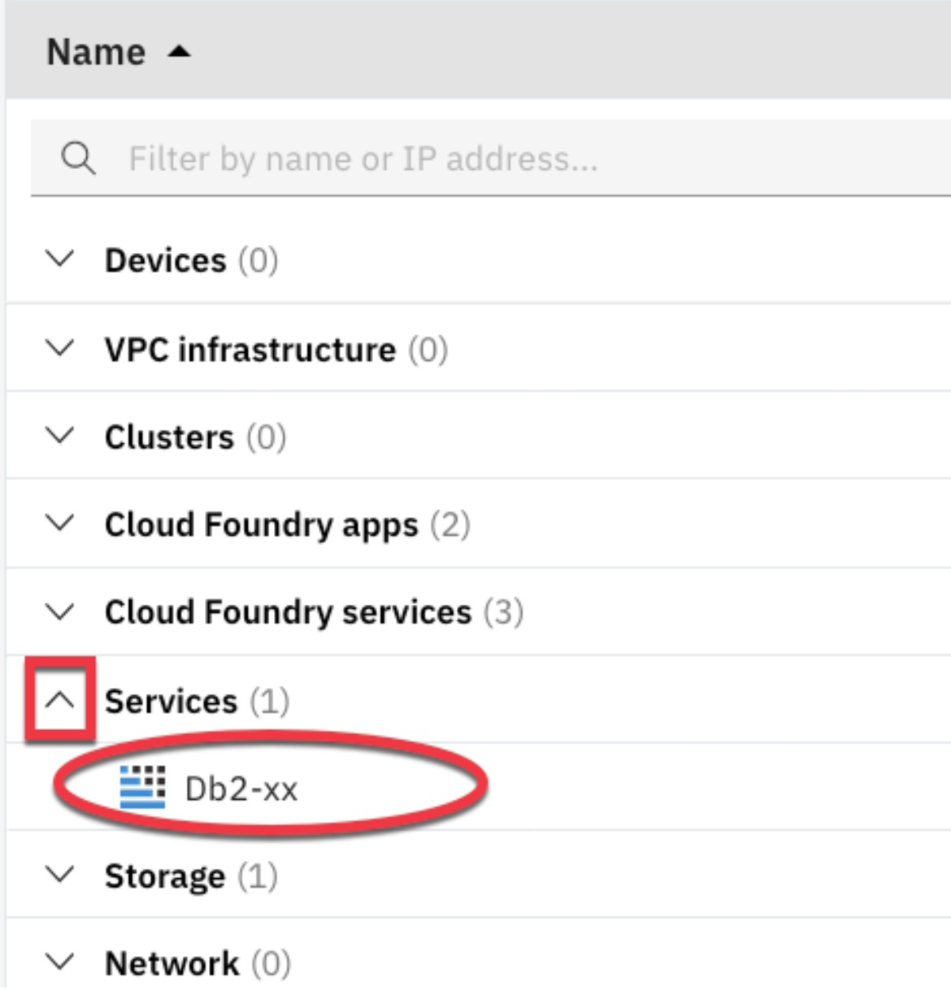
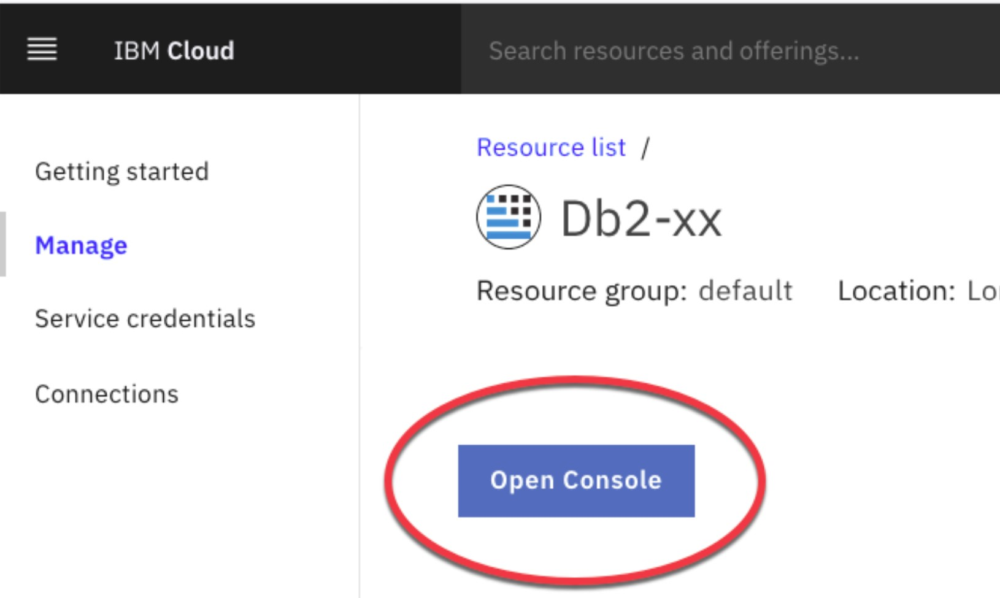
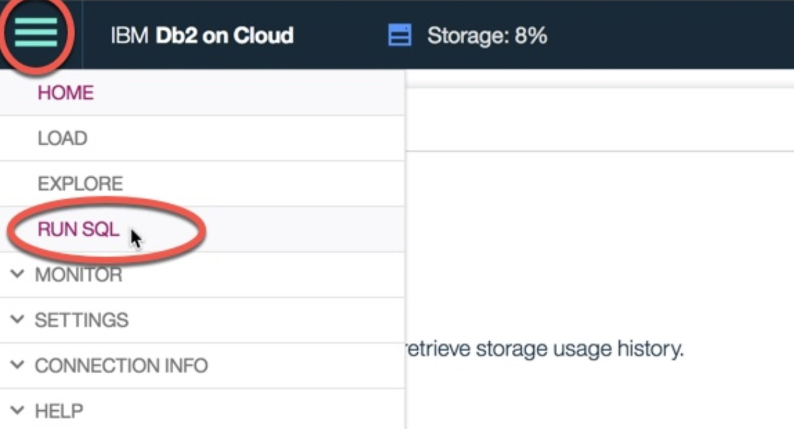

# Connecting to a DB2 database from Python

### Part 1: Creating a cloud DB2 database 

In order to use the IBM DB2 databases, you have to create an IBM cloud account. There is an IBM DB2 Lite plan that is free to use.
Go to this link : https://cloud.ibm.com/registration to create your IBM cloud account. 

Once logged in, you will notice a catalog option on the top left of the search bar. After going in the catalog make sure you choose DB2 and nothing else such as DB2 Warehouse, DB2 Hosted or SQL Query. Do not choose them. Only choose DB2.


In the Pricing Plans make sure to select the Lite plan as it is a free plan. Then click on CREATE at the bottom right of the page.

Open your dashboard and you will see a Resource List option. After going in the Resource List, locate and expand the Services and click on your instance of DB2 database.



Click on the open console button. This will open a new tab on your web browser and then choose the 3rd option from the top left drop down menu.
If you want to run SQL queries, you can do it from here.





You will need to have your Service Credentials in order to access this database from Python. So, go back to the page where there was an OPEN CONSOLE button, and on the left, you will be able to see the Service Credentials option.

Click on it and then select the New Credentials button to generate Service Credentials for your IBM DB2 Database.

### Part 2: Connecting to your database from Python

Your DB2 database has been created, but there are not tables yet. You are going to connect to your empty DB2 database and create some tables from Python. 

Tasks: 

1. Create a new project folder and install the python library ibm_db. In the terminal write 'pip install ibm_db'. For further installation instructions or requirements on ibm_db library, see here : https://pypi.org/project/ibm-db/

2. Once installed, in your notebook import your ibm_db library.

3. Create a connection to your DB2 database.

4. We have uploaded a file called create.sql with all the tables you need to create. Hands on creating those tables.

5. We have uploaded a file called values.sql with all the table values to be introduced into each table.

6. Fetch data from the authors table to confirm that it has uploaded successfully.

Now, the best thing about accessing databases through python is that you can load the database into Pandas data frame and you can use all the data science tools on the database using all the Python data science libraries.

```py
import pandas as pd
import ibm_db_dbi
```

Now we have to establish a connection for pandas.
```py
pd_conn = ibm_db_dbi.Connection(conn)
```
After establishing the connection, now we can load the database into the pandas data frame.

```py
selectQuery = "select * from books"

dataframe = pd.read_sql(selectQuery, pd_conn)

dataframe
```

7. Don't forget to close the connection. You have to free up all the resources by closing the connection. Remember that it is very important to close the connection so that we can avoid unused connections taking up resources.

Source:

https://www.db2tutorial.com/getting-started/create-db2-sample-database/

https://pypi.org/project/ibm-db/

https://medium.com/mozilla-firefox-club/accessing-ibm-db2-database-using-python-c356a4a76bf3
