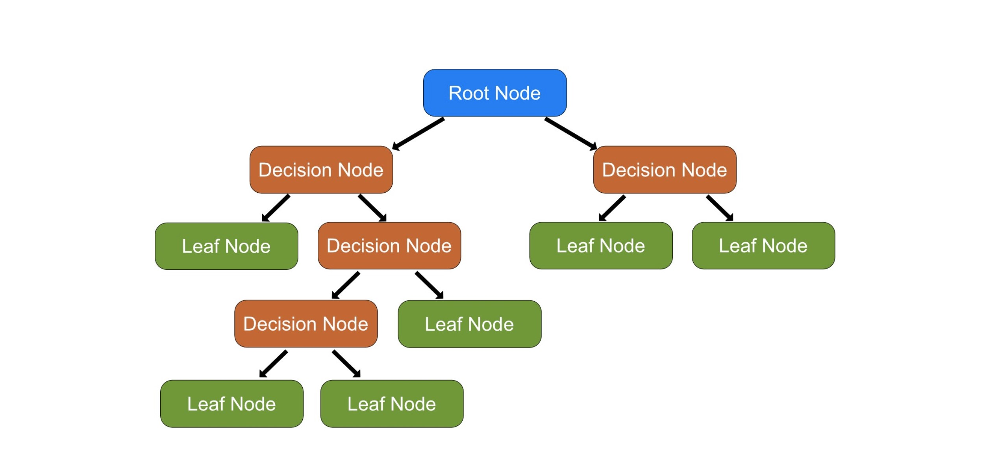
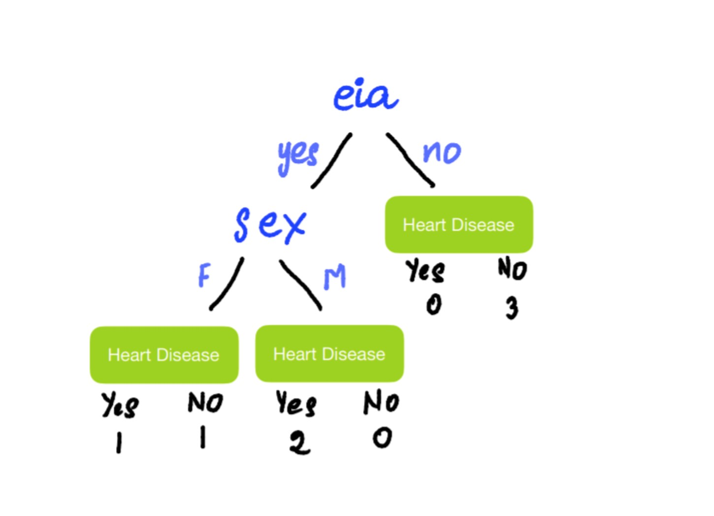

### Decision Trees

Decision trees belong to a class of supervised machine learning algorithms, which are used in both classification (predicts discrete outcome) and regression (predicts continuous numeric outcomes) predictive modeling. They are constructed from only two elements — nodes and branches.

**What are decision trees?**

Decision trees are a sequence of conditions that allow us to split the data iteratively (a node after another, essentially) until we can assign each data into a label. New data will simply follow the decision tree and end up in the most suitable category. 

They are used for classification, regression, to measure feature importance and for feature selection.

Let´s see a decision tree structure:

- Root node — node at the top of the tree. It contains a feature that best splits the data (a single feature that alone classifies the target variable most accurately)

- Decision nodes — nodes where the variables are evaluated. These nodes have arrows pointing to them and away from them

- Leaf nodes — final nodes at which the prediction is made

Depending on the dataset size (both in rows and columns), there are probably thousands to millions of ways the nodes and their conditions can be arranged. Now, let's look at a small example:

The leaves that contain a mixture of people who have and don’t have Heart Disease are called impure. We can quantify impurity using Gini Impurity, Entropy, and Information Gain. The higher the Gini Impurity, the more impure the leaves are. So we want the value to be as low as possible. We calculate the Gini Impurity of each of the leaves first, then calculate the total Gini Impurity of the split. The formula to calculate Gini Impurity of leaves is:

Gini impurity of a leaf: 1 - (probability of 'yes')^2 - (probability of 'no')^2

Finding Gini Impurity for continuous variables is a little more involved. First, we need to sort the column from lowest to highest, then calculate the average for adjacent rows. These average values will be our candidates for root node thresholds. Lastly, we calculate the Gini Impurity values for each average value. 

**Between several features, how do we know which feature should be the root node?**

We need to check how every input feature classifies the target variable independently. If none of the features alone is 100% correct in the classification, we can consider these features impure.

Gini impurity is calculated for all root node candidates, the one with the lowest Gini Impurity is going to be our root node.

To further decide which of the impure features is most pure, we can use the Entropy metric, whose value ranges from 0 (best) to 1 (worst). The variable with the lowest entropy is then used as a root node.

To begin training the decision tree classifier, we have to determine the root node. Then, for every single split, the Information gain metric is calculated. It represents an average of all entropy values based on a specific split. The higher the gain is, the better the decision split is.

To sum up:

- **Gini impurity** is a measurement of how often a randomly chosen record would be incorrectly classified if it was randomly classified using the distribution of the set of samples.

A low Gini (near 0) means most records from the sample are in the same class.

A high Gini (maximum of 1 or less, depending on number of classes) = records from sample are spread evenly across classes.

- **Entropy** is the measure of the purity of members among non-empty classes. It is very similar to Gini in concept, but a slightly different calculation.

Low entropy (near 0) means most records from the sample are in the same class.

High entropy (maximum of 1) means records from sample are spread evenly across classes.

**Are decision trees parametric or non-parametric models?**

Non-parametric. The number of model parameters is not determined before creating the model.

## What are the main hyperparameters that you can tune for decision trees?

Generally speaking, decision trees have the following parameters:

- max depth - maximum tree depth

- min samples split - minimum number of samples for a node to be split

- min samples leaf - minimum number of samples for each leaf node

- max leaf nodes - the maximum number of leaf nodes in the tree

- max features - maximum number of features that are evaluated for splitting at each node (only valid for algorithms that randomize features considered at each split)

The traditional decision tree is greedy and looks at all features at each split point, but many modern implementations allow splitting on randomized features (as seen in scikit learn) so max features may or may not be a tuneable hyperparameter.

## How each hyperparameter affects the model's ability to learn?**

- max depth: increasing max depth will decrease bias and increase variance 

- min samples split: increasing min samples split increases bias and decreases variance

- min samples leaf: increasing min samples leaf increases bias and decreases variance

- max leaf nodes: decreasing max leaf node increases bias and decreases variance

- max features: decreasing maximum features increases bias and decreases variance

There may be instances when changing hyperparameters has no effect on the model.

## Disadvantages of decision trees**

- Overfitting. Decision trees overfit very quickly. If you let them grow without a stopping mechanism or a correction mechanism after the tree has been trained, they can split so many times that each leaf is a sample. This means that they’ve literally learned how the training data set looks and suffer from high variance (generalize poorly to novel data). Check the chapter below for practical advice on correcting overfitting.

- Non-robust to input data changes. A small change in training data can result in a completely different tree. The overall accuracy might still be high, but the specific decision splits will be totally different.

- Biased towards the dominant class. Classification decision trees tend to favor predicting the dominant class in datasets with class imbalance. 

## What are some ways to reduce overfitting with decision trees?**

- Reduce maximum depth

- Increase min samples split

- Balance data to prevent bias toward dominant classes

- Increase the number of samples

- Decrease the number of features

## How is feature importance evaluated in decision-tree based models?**

The features that are split on most frequently and are closest to the top of the tree, thus affecting the largest number of samples, are considered to be the most important.

Source:

https://pythonkai.org/2021/12/20/machine-learning-for-beginners-project-4-decision-tree-classifier/

https://towardsdatascience.com/master-machine-learning-decision-trees-from-scratch-with-python-de75b0494bcd