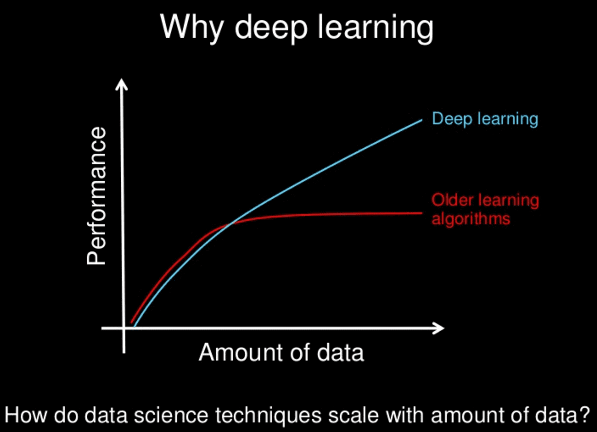
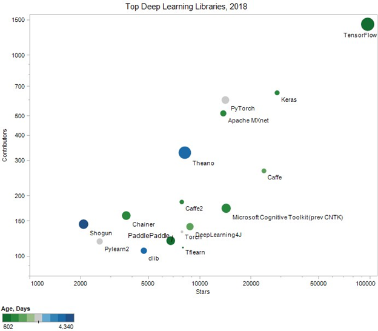

# Intro to Deep Learning

Deep learning is a sub-field of machine learning dealing with algorithms inspired by the structure and function of the brain called artificial neural networks. Deep learning algorithms are similar to how nervous system structured where each neuron connected each other and passing information.

Deep learning models tend to perform well with amount of data wheras old machine learning models stop improving after a saturation point. One of differences between machine learning and deep learning model is on the feature extraction area. Feature extraction is done by human in machine learning whereas deep learning model figure out by itself.



*Image by Andrew Ng at https://www.slideshare.net/ExtractConf*

**What are activation functions?**

Let's imagine an example about a model that decides if a student is accepted to a university based on its grades. Activation functions are functions that decide, given the inputs into the node, what should be the node’s output, so in this case the activation function decides, given the grades, if the student is accepted or not. 

One way in which neurons process inputs is by using linear combinations of weighted inputs (i.e., linear neuron). Another one is using a logistic function which returns a value between 0 and 1. Other activation functions you’ll see are tanh, and softmax functions.

**What are weights?**

When input data comes into a neuron, it gets multiplied by a weight value that is assigned to this particular input. These weights start out as random values, and as the neural network learns more about what kind of input data leads to a student being accepted into a university, the network adjusts the weights based on any errors in categorization that the previous weights resulted in. This is called training the neural network. Training neural networks can be viewed as a sort of optimization problem. The goal is to minimize the error of neural nets through constant training. 

To figure out how we’re going to find these weights, start by thinking about the goal. We want the network to make predictions as close as possible to the real values. To measure this, we need a metric of how wrong the predictions are, the error. A common metric is the sum of the squared errors (SSE), where y^ is the prediction and y is the true value, and you take the sum over all output units j and another sum over all data points μ.

The SSE is a good choice for a few reasons. The square ensures the error is always positive and larger errors are penalized more than smaller errors. Our goal is to find weights wij that minimize the squared error. To do this with a neural network, typically we use gradient descent. 

Do you remember our 'Algorithm Optimization' module? We saw a little bit of Gradient Descent.

Gradient descent is an optimization algorithm used to find the values of parameters (coefficients) of a function (f) that minimizes a cost function (cost). Gradient descent is best used when the parameters cannot be calculated analytically (e.g. using linear algebra) and must be searched for by an optimization algorithm. It uses derivatives and calculus techniques through back propagation, resilient propagation and Manhattan propagation and other optimization techniques based on gradient calculations.

Algebra and calculus are the foundation of the deep neural nets. 

**Neural networks**

The diagram below shows a simple network. Weights and biases are the learnable parameters. In the following equation: $y = mx+b$ 'm' (the slope) would be the weight and 'b' would represent bias. The linear combination of the weights, inputs, and bias form the input h, which passes through the activation function f(h), giving the final output, labeled y.


The activation function, f(h) can be any function. If we let f(h)=h, the output will be the same as the input. Now the output of the network is $y=Σi WiXi + b$

**Forward propagation**

By propagating values from the first layer (the input layer) through all the mathematical functions represented by each node, the network outputs a value. This process is called a forward pass. Let's see how to implement it with **Numpy**.

```py
import numpy as np

def sigmoid(x):
    """
    Calculate sigmoid
    """
    return 1/(1+np.exp(-x))

# Network size
N_input = 4
N_hidden = 3
N_output = 2

np.random.seed(42)
# Make some fake data
X = np.random.randn(4)

weights_input_to_hidden = np.random.normal(0, scale=0.1, size=(N_input, N_hidden))
weights_hidden_to_output = np.random.normal(0, scale=0.1, size=(N_hidden, N_output))


# TODO: Make a forward pass through the network

hidden_layer_in = np.dot(X, weights_input_to_hidden)
hidden_layer_out = sigmoid(hidden_layer_in)

print('Hidden-layer Output:')
print(hidden_layer_out)

output_layer_in = np.dot(hidden_layer_out, weights_hidden_to_output)
output_layer_out = sigmoid(output_layer_in)

print('Output-layer Output:')
print(output_layer_out)

```
You **forward propagate** to get the output and compare it with the real value to get the error. Now, to minimise the error, you propagate backwards by finding the derivative of error with respect to each weight and then subtracting this value from the weight value. This is called **back propagation**.

Now let's see the code for implementing the entire propagation:

```py
import numpy as np
from data_prep import features, targets, features_test, targets_test

np.random.seed(21)

def sigmoid(x):
    """
    Calculate sigmoid
    """
    return 1 / (1 + np.exp(-x))


# Hyperparameters
n_hidden = 2  # number of hidden units
epochs = 900
learnrate = 0.005

n_records, n_features = features.shape
last_loss = None
# Initialize weights
weights_input_hidden = np.random.normal(scale=1 / n_features ** .5,
                                        size=(n_features, n_hidden))
weights_hidden_output = np.random.normal(scale=1 / n_features ** .5,
                                         size=n_hidden)

for e in range(epochs):
    del_w_input_hidden = np.zeros(weights_input_hidden.shape)
    del_w_hidden_output = np.zeros(weights_hidden_output.shape)
    for x, y in zip(features.values, targets):
        ## Forward pass ##
        # TODO: Calculate the output
        hidden_input = np.dot(x, weights_input_hidden)
        hidden_output = sigmoid(hidden_input)

        output = sigmoid(np.dot(hidden_output,
                                weights_hidden_output))

        ## Backward pass ##
        # TODO: Calculate the network's prediction error
        error = y - output

        # TODO: Calculate error term for the output unit
        output_error_term = error * output * (1 - output)

        ## propagate errors to hidden layer

        # TODO: Calculate the hidden layer's contribution to the error
        hidden_error = np.dot(output_error_term, weights_hidden_output)

        # TODO: Calculate the error term for the hidden layer
        hidden_error_term = hidden_error * hidden_output * (1 - hidden_output)

        # TODO: Update the change in weights
        del_w_hidden_output += output_error_term * hidden_output
        del_w_input_hidden += hidden_error_term * x[:, None]

    # TODO: Update weights
    weights_input_hidden += learnrate * del_w_input_hidden / n_records
    weights_hidden_output += learnrate * del_w_hidden_output / n_records

    # Printing out the mean square error on the training set
    if e % (epochs / 10) == 0:
        hidden_output = sigmoid(np.dot(x, weights_input_hidden))
        out = sigmoid(np.dot(hidden_output,
                             weights_hidden_output))
        loss = np.mean((out - targets) ** 2)

        if last_loss and last_loss < loss:
            print("Train loss: ", loss, "  WARNING - Loss Increasing")
        else:
            print("Train loss: ", loss)
        last_loss = loss

# Calculate accuracy on test data
hidden = sigmoid(np.dot(features_test, weights_input_hidden))
out = sigmoid(np.dot(hidden, weights_hidden_output))
predictions = out > 0.5
accuracy = np.mean(predictions == targets_test)
print("Prediction accuracy: {:.3f}".format(accuracy))

```

## Top applications of deep learning in 2022

- Self driving cars

- News aggregation and fraud news detection

- Natural Language Processing

- Virtual Assitants

- Visual Recognition

- Fraud detection

- Personalized experiences in e-commerce

- Detecting developmental delay in children

- Healthcare: from medical imaging, discovering new drugs, clinical research.

- Colourisation of Black and White images

- Adding sounds to silent movies

- Automatic Machine Translation

- Automatic Handwriting Generation

- Automatic Game Playing

- Language Translations

- Pixel Restoration

- Photo Descriptions

- Demographic and Election Predictions

- Deep Dreaming

## Software tools

The following graph shows the top 16 open-source deep learning libraries used by Github contributors.



*Image by KDnuggets*

By all measures, TensorFlow is the undisputed leader, followed by Keras.

### **TensorFlow** 

Tensorflow is a Python open-source library for fast numerical computing created and released by Google. It was designed for use both in research and development and in production systems. It can run on single CPU systems and GPUs, as well as mobile devices and large-scale distributed systems of hundreds of machines.

Computation is described in terms of data flow and operations in the structure of a directed graph.

- Nodes: Nodes perform computation and have zero or more inputs and outputs. Data that moves between nodes are known as tensors, which are multi-dimensional arrays of real values.

- Edges: The graph defines the flow of data, branching, looping, and updates to state. Special edges can be used to synchronize behavior within the graph, for example, waiting for computation on a number of inputs to complete.

- Operation: An operation is a named abstract computation that can take input attributes and produce output attributes. For example, you could define an add or multiply operation.


The best place to start is with the user-friendly Keras sequential API. Build models by plugging together building blocks.


Here a first example on how you can define values as tensors and execute an operation:

```bash
pip install tensorflow
```

```py
import tensorflow as tf
a = tf.constant(10)
b = tf.constant(32)
print(a+b)

>>>>>tf.Tensor(42, shape=(), dtype=int32)
```


### **Keras** 

Keras is a high-level neural networks API, written in Python and capable of running on top of TensorFlow, CNTK, or Theano.


Source: 

https://machinelearningmastery.com/inspirational-applications-deep-learning/

https://heartbeat.comet.ml/deep-learning-techniques-you-should-know-in-2022-94f33e62d922

https://machinelearningmastery.com/introduction-python-deep-learning-library-tensorflow/

https://medium.com/intro-to-artificial-intelligence/deep-learning-series-1-intro-to-deep-learning-abb1780ee20

https://medium.com/@genvill/9-ways-to-become-the-macgyver-of-deep-learning-4f0133bc1f14

https://becominghuman.ai/face-detection-with-opencv-and-deep-learning-90b84735f421

https://machinelearningmastery.com/linear-algebra-cheat-sheet-for-machine-learning/

https://www.mygreatlearning.com/blog/deep-learning-applications/

http://playground.tensorflow.org/#activation=tanh&batchSize=10&dataset=circle&regDataset=reg-plane&learningRate=0.03&regularizationRate=0&noise=0&networkShape=4,2&seed=0.88210&showTestData=false&discretize=false&percTrainData=50&x=true&y=true&xTimesY=false&xSquared=false&ySquared=false&cosX=false&sinX=false&cosY=false&sinY=false&collectStats=false&problem=classification&initZero=false&hideText=false
