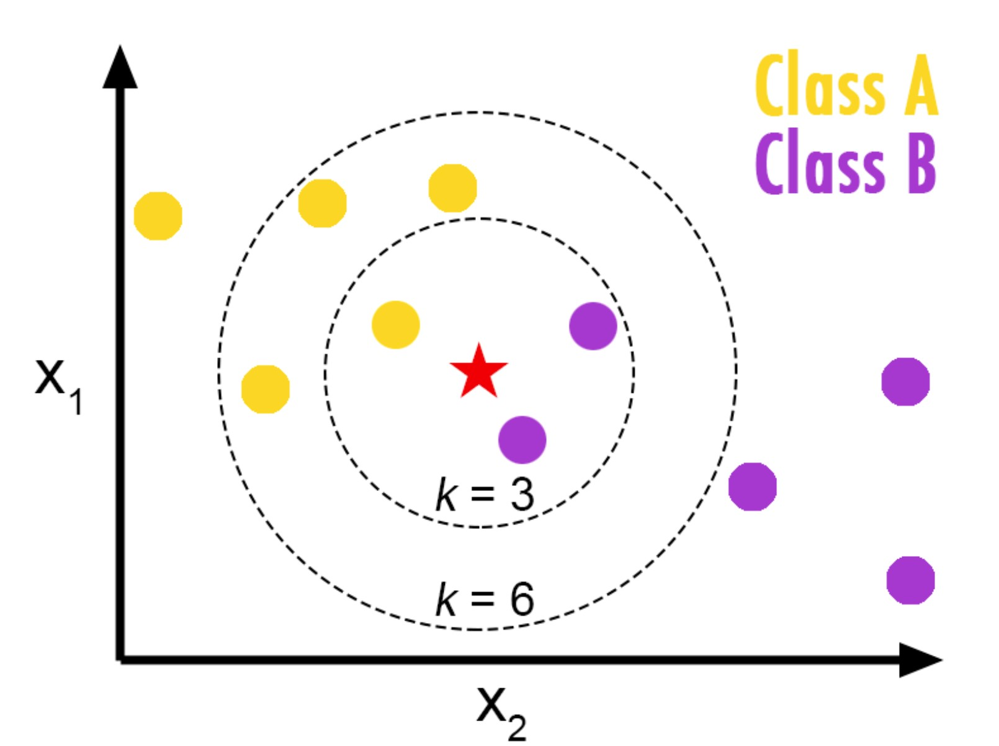
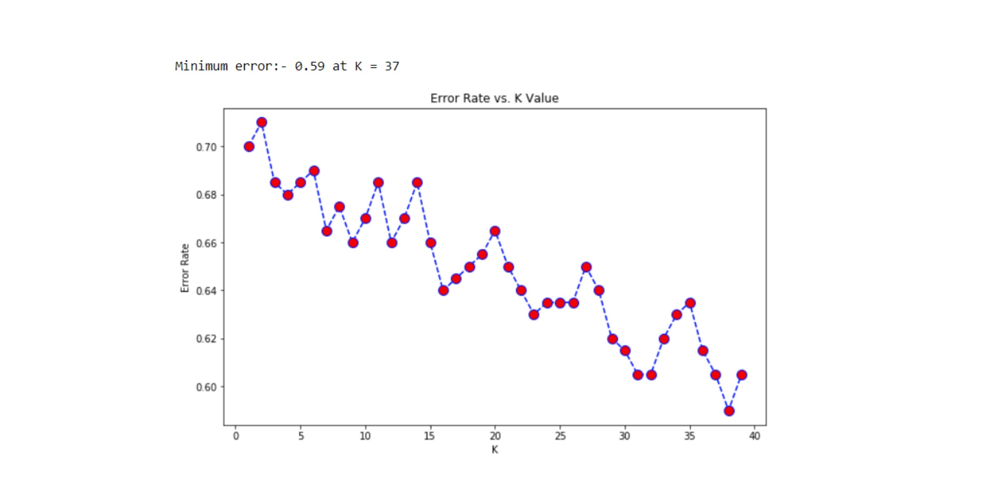

# K Nearest neighbors (KNN)

Before we start learning the K-nearest neighbors algorithm, we first need to clarify the difference between K-means clustering and k-nearest neighbors algorithm because they are often confused with each other.

We want to let you know that the ‘K’ in K-Means Clustering has nothing to do with the ‘K’ in KNN algorithm. k-Means Clustering is an unsupervised learning algorithm that is used for clustering whereas KNN is a supervised learning algorithm used for classification.

**What is K-nearest neighbors (KNN)?**

When you think about KNN think about your friends. You are the average of the people you spend most time with.
When you think about your feature space, think of it as your neoghborhood, where each data point has a neightbor.

KNN is a simple algorithm but it's very powerful. It makes predictions by averaging the k neighbors nearest to a given data point. For example, if we wanted to predict how much money a potential customer would spend at our store, we could find the 5 customers most similar to her and average their spending to make the prediction.

The average could be weighted based on similarity between data points and the similarity distance metric could be defined as well.

**Is KNN a parametric or non-parametric algorithm? Is it used as a classifier or regressor?**

KNN is non-parametric, meaning we don´t make any assumptions about the underlying distribution of your data, and KNN can be used either as a classifier or regressor. 

## How KNN works?

KNN makes predictions by:

-Averaging, for regression tasks.

-Majority voting for classification tasks.

The two important steps are:

1. Choosing the right distance metric. Distance is heavily utilized in KNN. It just measures the distance between two data points.

But what distance metric should I choose?

- Manhattan distance for continuous values. We get the absolute values of the distances with the formula $|x1 - x2| + |y1 - y2|$.

- Euclidean distance for continuous values. Is the shortest and one of the most popular distance metrics of choice.

- Hamming distance for categorical values. If both of our values are related (both have 1) we would get 0, meaning they are exactly the same. If our distance metric is 1, they are not the same.

- Cosine similarity distance (for word vectors). What the angle is between two different points.

2. Choosing the value of k

How should we choose the value of k?

*image by helloacm.com*

Manipulating the value of k is going to alter your predictions in order of who your neighbors are. An effective and simple way to choose k is applying cross validation. Cross validation is a very used technique to evaluate your algorithm efficiently, not only with KNN but also with other algorithms. In the case of KNN it means trying different values of k and choosing the one with the smallest error or best performance. 

> Increasing K will normally increase bias and reduce variance, and viceversa.

*image by towardsdatascience.com*

### Pros and Cons

### KNN and Recommender Systems

**How do we select the ideal number of neighbors for KNN?**

There is no closed-form solution for calculating k, so various heuristics are often used. It may be easiest to simply do cross validation and test several different values for k and choose the one that produces the smallest error during cross validation.

As k increases, bias tends to increase and variance decreases.

Source:

https://www.dataquest.io/blog/top-10-machine-learning-algorithms-for-beginners/#:~:text=The%20first%205%20algorithms%20that,are%20examples%20of%20supervised%20learning.

https://towardsdatascience.com/how-to-find-the-optimal-value-of-k-in-knn-35d936e554eb

https://becominghuman.ai/comprehending-k-means-and-knn-algorithms-c791be90883d