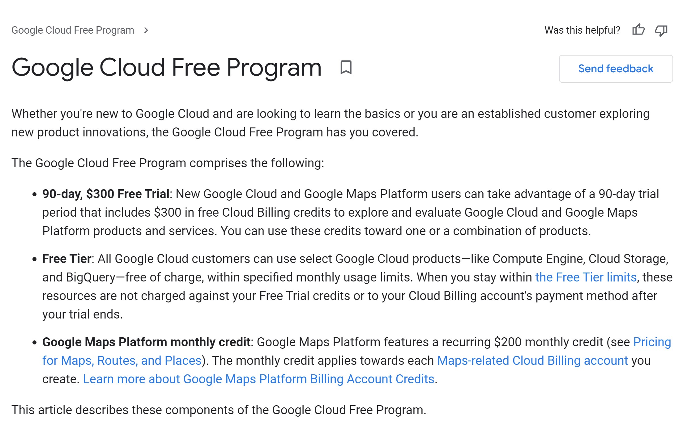

# Cloud data warehouses

## Google Cloud Platform

Google Cloud Platform offers you three¹ ways to carry out machine learning:

- Keras with a TensorFlow backend to build custom, deep learning models that are trained on Cloud ML Engine

- BigQuery ML to build custom ML models on structured data using just SQL

- Auto ML to train state-of-the-art deep learning models on your data without writing any code

Choose between them based on your skill set, how important additional accuracy is, and how much time/effort you are willing to devote to the problem. Use BigQuery ML for quick problem formulation, experimentation, and easy, low-cost machine learning. Once you identify a viable ML problem using BQML, use Auto ML for code-free, state-of-the-art models. Hand-roll your own custom models only for problems where you have lots of data and enough time/effort to devote.

Check out the Google Cloud Platform free program to discover new tools for your machine learning models.

### Big Query

With BigQuery, there’s no infrastructure to set up or manage, letting you focus on finding meaningful insights using standard SQL and taking advantage of flexible pricing models across on-demand and flat-rate options. In BigQuery ML, you can use a model with data from multiple BigQuery datasets for training and for prediction.

**Benefits**

- Cost effective

- Real-time analytics

- Serverless solution

- Geoexpansion

- Automatic backup and easy restore

[Big Query official documentation](https://cloud.google.com/bigquery/docs)

If you are new/want to explore GCP for first time, then use google sandbox account which is free and login with your account information and can access GCP toolkit with limited resource.

#### Big Query ML

**Benefits:**

- You don't need to know Python or any other language for managing Machine Learning models. You can train models and make predictions using SQL queries.

- The data export involves many steps, and it’s a time-consuming process. Google BigQuery ML saves time and resources by letting users use Machine Learning models in Google BigQuery.

- It allows users to run Machine Learning models on large datasets within minutes as it uses computation resources of Google BigQuery Data Warehouse.

- It features some automated Machine Learning models that reduce the workload to manipulate data manually. It saves time and allows users to quickly train and test models on the dataset.

[Big Query ML official documentation](https://cloud.google.com/bigquery-ml/docs)

## Amazon

## Microsoft Azure

**Source:**

-https://medium.com/ibm-data-ai/machine-learning-in-google-cloud-with-bigquery-25d40b158f91

-https://medium.com/@rajdeepmondal/predicting-cab-fare-for-chicago-using-bqml-395126343c92

-https://windsor.ai/how-to-get-your-analytics-crm-and-media-data-into-bigquery/

-https://towardsdatascience.com/build-a-useful-ml-model-in-hours-on-gcp-to-predict-the-beatles-listeners-1b2322486bdf

-https://towardsdatascience.com/choosing-between-tensorflow-keras-bigquery-ml-and-automl-natural-language-for-text-classification-6b1c9fc21013