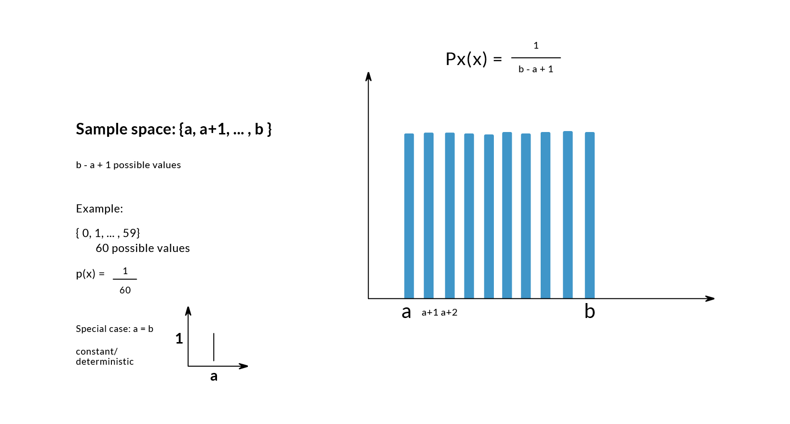
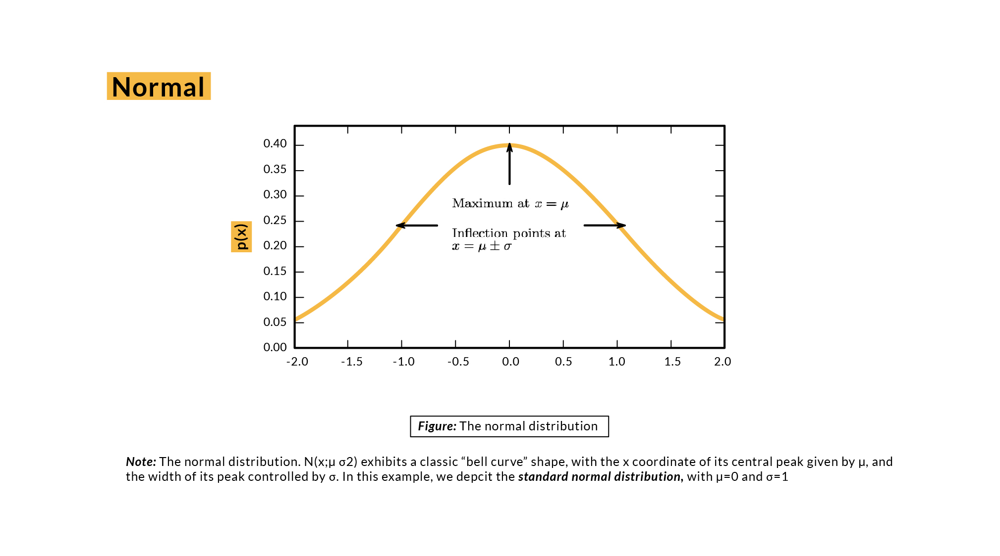
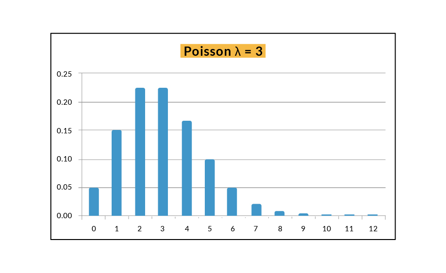

# Random Variables

A random variable is a variable that can take on different values randomly.

On its own, a random variable is just a description of the states that are possible; it must be coupled with a probability distribution that specifies how likely each of these states are. A random variable $X$ is a function that maps events to real numbers.

Random Variables may be discrete or continuous.

1. A discrete variable is one that has a finite or countably infinite number of states. Note that these states are not necessarily the integers. They can also just be named states that are not considered to have any numerical value.

2. A continuous variable is associated with a real value, so it can take an uncountable number of values.

### Types of random variables


**Discrete random variable:**

-It has a finite number of states, not necesarily integers. They can also be a named states that are not considered to have any numerical value. Example: Coin toss (2 states), Throwing a dice (6 states), Drawing a card from a deck of cards (52 states), etc.

**Continuous random variable:**

-Must be associated with a real value. Example: Rainfall on a given day (in centimeters), Stock price of a company, Temperature of a given day.


In statistics we represent a distribution of discrete variables with PMF's (Probability Mass Functions). The PMF defines the probability of all possible values $x$ of the random variable.  We represent distributions of continuous variables with PDF's (Probability Density Functions).
CDF's (Cumulative Distribution Functions) represent the probability that the random variable $X$ will have an outcome less or equal to the value $x$. CDF's are used for both discrete and continuous distributions.

### Probability Mass Function (PMF)

Let's visualize the function and the graph of the PMF of a binomial distribution:


```python


import numpy as np
import matplotlib.pyplot as plt
from scipy.stats import binom

n = 80
p = 0.5

x = np.arange(binom.ppf(0.01, n, p), binom.ppf(0.99, n, p))

fig, ax = plt.subplots(1, 1, figsize=(15,7))

ax.plot(x, binom.pmf(x, n, p), 'bo', ms=8, label='Binomial PMF')
ax.vlines(x, 0, binom.pmf(x, n, p), colors='b' , lw=3, alpha=0.5)

rv = binom(n, p)

ax.legend(loc='best', frameon=False, fontsize='xx-large')
plt.title('PMF of a binomial distribution (n=80, p=0.5)', fontsize='xx-large')
plt.show()
```


### Probability Density Functions (PDF)


The Probability Density Function is the same as a Probability Mass Function, but for continuous variables. It can be said that the distribution has an infinite number of possible values.

Let's visualize the function and the graph for the PDF of a normal distribution: 


```python
from scipy.stats import binom

mu = 0
variance = 1
sigma = sqrt(variance)
x = np.linspace(mu - 3*sigma, mu + 3*sigma, 100)
plt.figure(figsize=(16,5))
plt.plot(x, stats.norm.pdf(x, mu, sigma), label='Normal Distribution')
plt.title('Normal Distribution with mean = 0 and std = 1')
plt.legend(fontsize='xx-large')
plt.show()
```


### Cumulative Distribution Function

The CDF maps the probability that a random variable $X$ will take a value of less than or equal to a value $x$ $(P(X ≤ x))$. In this section we will visualize only the continuous case. The CDF accumulates all probabilities and is therefore bounded between $0 ≤ x ≤ 1$.

Let's visualize the function and graph of a CDF of a normal distribution:


```python
# Data
X  = np.arange(-2, 2, 0.01)
Y  = exp(-X ** 2)

# Normalize data
Y = Y / (0.01 * Y).sum()

# Plot the PDF and CDF
plt.figure(figsize=(15,5))
plt.title('Continuous Normal Distributions', fontsize='xx-large')
plot(X, Y, label='Probability Density Function (PDF)')
plot(X, np.cumsum(Y * 0.01), 'r', label='Cumulative Distribution Function (CDF)')
plt.legend(fontsize='xx-large')
plt.show()
```


# Probability Distributions


A probability distribution is the description of how likely a random variable or set of random variables is to take on each of its possible states. The way we describe probability distributions depends on whether the variables are discrete or continuous.

**Binomial Random Variable**

The *Binomial Distribution* with parameters $n$ and $p$ is the discrete probability distribution of the number of successes in a sequence of $n$ independent experiments. It is frequently used to model the number of successes in a sample of size $n$ drawn with replacement from a population of size $N$.

Binomial probability distributions help us to understand the likelihood of rare events and to set probable expected ranges.

Binomial distributions must meet three criteria:

1. The number of trials is fixed.
2. Each trial is independent.
3. The probability of succeess is exactly the same for all trials.


**Bernoulli random variable**

Bernoulli distribution is a special case of a Binomial distribution.
It models a trial that results in success or failure. For example, heads or tails. All values in a Bernoulli distribution are either 0 or 1. Let's imagine the coin we have is not a fair coin, because it's probability of falling heads is 70%. The distribution would as follows:

heads = $1$

$p(heads) = p = 0.7$

tails = $0$

$p(tails) = 1 - p = 0.3$

The *Bernoulli Distribution* is a distribution over a single binary random variable.

It is controlled by a single parameter, which gives the probability of the random variable being equal to $1$.

It has the following properties:


**Uniform random variable**

Models when there is complete ignorance that a result would have more probability than others. So all possible outcomes are equally likely. Therefore, the distribution consists of random values with no patterns in them.
A uniform distribution would be as follows:



Let's generate a scatterplot with random floating numbers between $0$ and $1$:


```python
# Uniform distribution (between 0 and 1)
uniform_dist = np.random.random(1000)
uniform_df = pd.DataFrame({'value' : uniform_dist})
uniform_dist = pd.Series(uniform_dist)
```


```python
plt.figure(figsize=(18,5))
sns.scatterplot(data=uniform_df)
plt.legend(fontsize='xx-large')
plt.title('Scatterplot of a Random/Uniform Distribution', fontsize='xx-large')

```


    Text(0.5, 1.0, 'Scatterplot of a Random/Uniform Distribution')


**Normal Distribution**


Finally the most commonly used distribution over real numbers, also known as Gaussian distribution, or bell curve mainly because of the Central Limit Theorem (CLT), which states that as the amount independent random samples (like multiple coin flips) goes to infinity the distribution of the sample mean tends towards a normal distribution.

The two parameters are $μ$ (mu = population mean) and $σ$ (sigma = population standard deviation) control the normal distribution.

The parameter $μ$ gives the coordinate of the central peak, which is also the mean of the distribution $E[X] = μ$.

The standard deviation of the distribution is given by $σ$ and the variance by $σ2$.

Normal distribution encodes the maximum amount of uncertainty over the real numbers. We can thus think of the normal distribution as being the one that inserts the least amount of prior knowledge into a model.

The following image shows a normal distribution:



Now let's generate 2 samples with normal distribution:


```python
# Sample 1 with normal distribution
normal_dist = np.random.randn(1000)
normal_df = pd.DataFrame({'value' : normal_dist})
# Create a Pandas Series for easy sample function
normal_dist = pd.Series(normal_dist)

# Sample 2 with normal distribution
normal_dist2 = np.random.randn(1000)
normal_df2 = pd.DataFrame({'value' : normal_dist2})
# Create a Pandas Series for easy sample function
normal_dist2 = pd.Series(normal_dist)

normal_df_total = pd.DataFrame({'value1' : normal_dist, 'value2' : normal_dist2})
```

First, we will look at the distribution with a bell curve:


```python
# Normal Distribution as a Bell Curve
plt.figure(figsize=(18,5))
sns.distplot(normal_df)
plt.title('Normal distribution (n=1000)', fontsize='xx-large')
```

    C:\Users\danie\AppData\Local\Programs\Python\Python310\lib\site-packages\seaborn\distributions.py:2619: FutureWarning: `distplot` is a deprecated function and will be removed in a future version. Please adapt your code to use either `displot` (a figure-level function with similar flexibility) or `histplot` (an axes-level function for histograms).
      warnings.warn(msg, FutureWarning)


    Text(0.5, 1.0, 'Normal distribution (n=1000)')


Now let's see the normal distribution with a scatterplot:


```python
# Normal distribution as a scatterplot
plt.figure(figsize=(15,8))
sns.scatterplot(data=normal_df)
plt.legend(fontsize='xx-large')
plt.title('Scatterplot of a Normal Distribution', fontsize='xx-large')
```


    Text(0.5, 1.0, 'Scatterplot of a Normal Distribution')


What is a long tailed distribution?

A long-tailed distribution is one where there are many relatively extreme, but unique, outliers.

Special techniques must be used, such as doing clustering on the tail, when dealing with long tailed datasets in order to leverage them to train classification or other predictive models.

**Poisson Distribution**


It is a discrete probability distribution that expresses the probability of a given number of events occuring in a fixed  interval of time or space. It takes a value lambda, which is equal to the mean of the distribution.
The Poisson process is a continuous time version of the Bernoulli process.

In what kind of situations does the Poisson process appear?

In general, it appears whenever we have events like arrivals that are somewhat rare and happen in a completely uncoordinated way so that they can show up at any particular way.

Some examples that may follow a Poisson distribution are:

1. Number of phone calls received by a call center per hour.
2. Number of patients arriving in an emergency room bewteen 10pm and 11pm.




**Geometric Random Variables**

Geometric distribution is a probability distribution that describes the number of times a Bernoulli trial needs to be conducted in order to get the first success after a consecutive number of failures.

Sample space: set of infinite sequences of Heads and Tails

Random variable $X$: number of tosses until the first Heads

Model of: waiting times, number of trials until a success


### EXPECTED VALUE

The expected value is exactly what it sounds like, what do you expect the value to be? 
The expected value is the mean of a random variable.
You can use this to work out the average score of a dice roll over 6 rolls.


Given the outcomes=$(1, 2)$ and the probabilities=$(1/8, 1/4)$, the expected value $E[x]$ is: $E[x]$ = $1(1/8) + 2(1/4) = 0.625$.

Interpretation: average in large number of independent repetitions.
    
Caution: If we have an infinite sum, it needs to be well-defined.

**Rules**

-Linearity of Expected Value

$E[F+G] = E[F] + E[G]$.

-Multiplication Rule of Expected Value

$E[F x G]$ does not equal $E[F] * E[G]$

References: 

https://www.kaggle.com/code/carlolepelaars/statistics-tutorial/notebook

